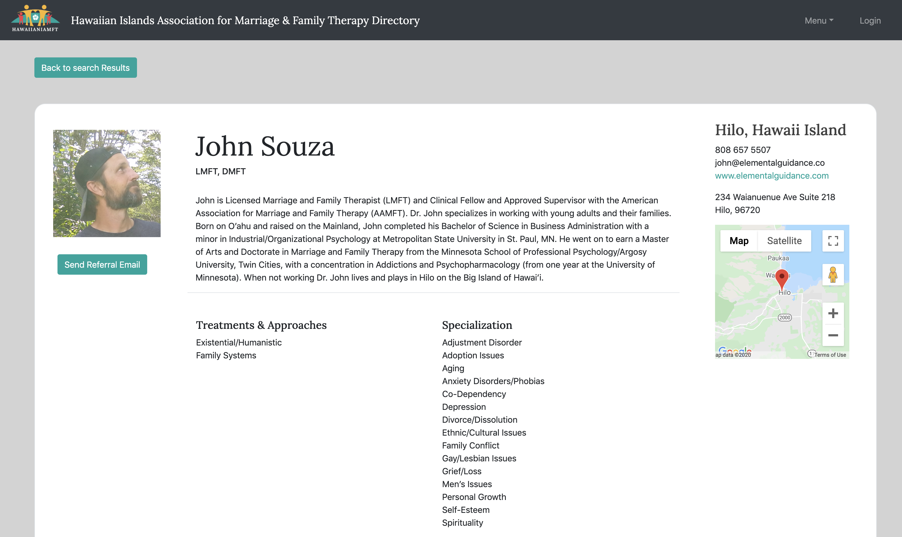
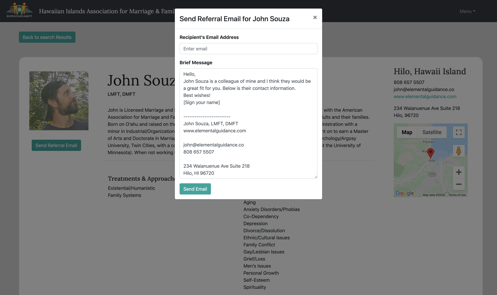
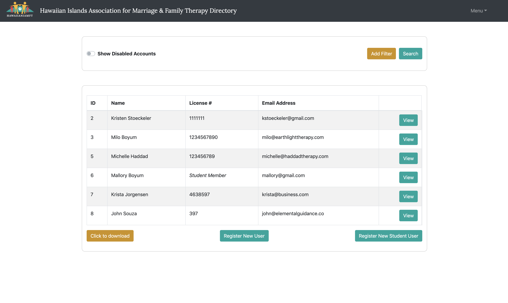

# Hawaiian Islands Marriage and Family Therapy Directory

## Description 

_Duration: 4 months_

The HIAMFT Therapist Directory is a web-based directory and member database. As a directory, this web application features public HIAMFT therapist member listings, helping people search and find therapists that fit their particular needs. Featuring Advanced Search options, autogenerated Therapist Referral Emails, and an easy-to-use Google Maps feature, the HIAMFT Therapist Directory makes it easy for HIAMFT therapists to connect with new clients. Additionally, the administrative member database functionality allows HIAMFT to easily search their members, manage memberships, and export their data. 
 
Stay tuned to see the fully functional site coming September 2020. Visit the beta version [HERE](https://hiamftdirectory.herokuapp.com/#/home) .

## Built with

- React
- Redux
- Sagas
- Node
- Express
- PostgreSQL
- Passport
- Axios
- React Bootstrap
- CSS
- Heroku
- Google Map API 
- FileSaver 
- NodeMailer

## Prerequisites

- [Node.js](https://nodejs.org/en/)
- [PostrgeSQL](https://www.postgresql.org/)
- [Nodemon](https://nodemon.io/)

## Installation 

1. Create a database named `hawaii_mft`.
2. The queries in the database.sql file are set up to create all the necessary tables and populate the needed data to allow the application to run correctly. The project is built on Postgres, so you will need to make sure to have that installed. We recommend using Postico to run those queries as that was used to create the queries,
3. Open up your editor of choice and run an npm install in the terminal
4. Run npm run server in your terminal
5. Run npm run client in your terminal
6. The npm run client command will open up a new browser tab for you!

## Usage
1. Aiden is a Licensed Marriage & Family Therapist (LMFT) and a member of the Hawaiian Islands Association for Marriage and Family Therapy (HIAMFT). As a member of HIAMFT, Aiden receives the benefit of creating a listing for HIAMFT's web-based Therapist Directory. 
2. Aiden receives a registration link from HIAMFT's administrator, and follows a the Create Profile process, that asks for all sorts of information about Aiden and their professional practice. At the end of the process, Aiden uploads their professional headshot as their profile picture.
3. Emily is a resident of Maui and is looking for a new therapist. She visits the HIAMFT Therapist Directory, where she uses the Advanced Search functionality to search the Directory for therapists who practice on Maui, specialize in therapy for PTSD, and also take her specific type of insurance. 
4. Aiden is one of the top results in Emily's search, fitting all three of her criteria. She clicks on Aiden's Profile Snapshot to see their full listing and from the handy map tool's location pin, she can see that Aiden's practice is in a very convenient location. Success! She email Aiden immediately using the email address provided to set up an appointment. 
5. One of Aiden's long-time clients Jenessa is moving to the Big Island and will need to find a new therapist closer to home. So Aiden wants to refer Jenessa to one of their colleagues Rose who is also a HIAMFT member. To do this, Aiden searches for their colleague Rose in the Directory. Upon navigating to Rose's Profile, Aiden clicks the Send Referral Email button which opens a modal that allows Aiden to type in Jenessa's email address. Upon clicking Send, an autogenerated email with a personalized message from Aiden along with all of Rose's contact information is sent straight to Jenessa's inbox. 
6. Berit is a volunteer administrator at HIAMFT and uses the admin functionality of the directory as a membership database. Berit needs to send a specialized mailing to all of HIAMFT's members who live on the Big Island for a unique meetup for therapists specializing in PTSD. To do this, Berit adds two parameters to search the database by: island location (Hawaii Island) and specialization (PTSD). Then Berit clicks the Download button to download all of the member information from this specific search to a .csv file so they can print off mailing labels from their home printer.
7. Lastly, Berit has received a new membership registration form through HIAMFT's main website, so Berit clicks the Register New User button to send a unique registration link to the brand new member for them to create a listing in the HIAMFT Therapist Directory. 

## Acknowledgement

Thanks to Prime Digital Academy who equipped and helped us make this web-based directory a reality. Thank you to HIAMFT and John Souza for letting us tackle this problem and build this web application. Finally, thanks to Dennis Woldemariam, Justin Horner and Mark Spannbauer for being exceptional teammates.

## Support

If you have suggestions or issues, please contact me through [LinkedIn](https://www.linkedin.com/in/kristenstoeckeler/) .

